# Basic Auth Setup and Frontend Prep

## Overview

In this project you will complete the code to setup a basic `auth` server. Additionally,
you will create a basic frontend with a `login` and `register` functionality using `React.

## Requirements

Clone this repo before you start.

### Your `backend` folder should work

1. Go into `/backend` folder. The `/backend` folder has the following `/src`

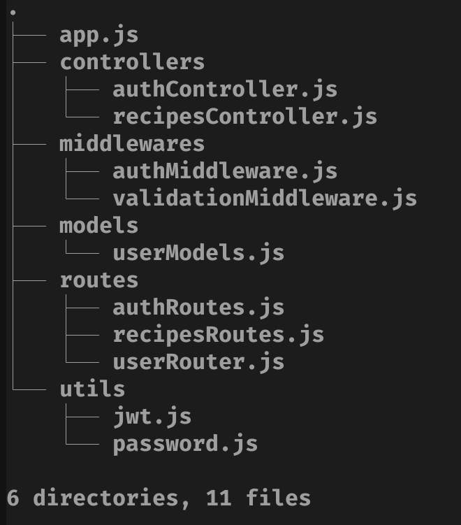

2. Complete all `TODOS` in the following files

> [!IMPORTANT]
> Some files will contain scattered lines. Your task is to
> identify which lines are missing and where to put them.
> The server will have lots of errors, so ensure you can solve them
> one by one. Go into the following files and complete/read `TODOS`/`NOTES`.

- `.env`
- `app.js`
- `authRoutes.js`
- `validationMiddleware.js`
- `authController.js`

> [!NOTE]
> Our objective here is to get comfortable with the basic workflow of auth. You will
> be using this repo as a starter point for upcoming projects/assignments.

3. Create the following endpoint to check your users and make sure it works! Test it.

```javascript
// WARN: Experimental and must NOT be used in real world
// this is for demo purposes for you to check that the "model" users
// has some actual users.
// The following line must be in file `app.js`.
app.use("/user", userRouter);
```

4. After finishing all `TODOS/NOTES`, your backend should be "functional". To test it, use any client like `postman` test your `backend` so you can do the following in the same order.

- `GET /`
  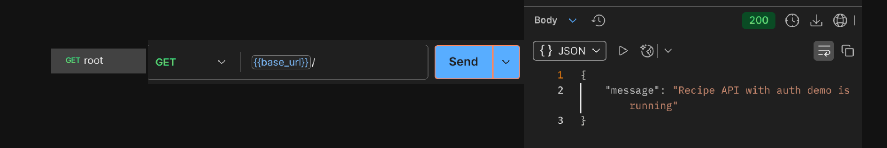
- `GET /user`
  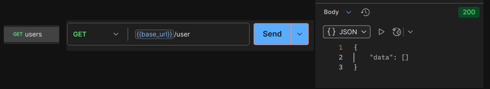
- `POST /auth/register` - ensure you send the `request body`
  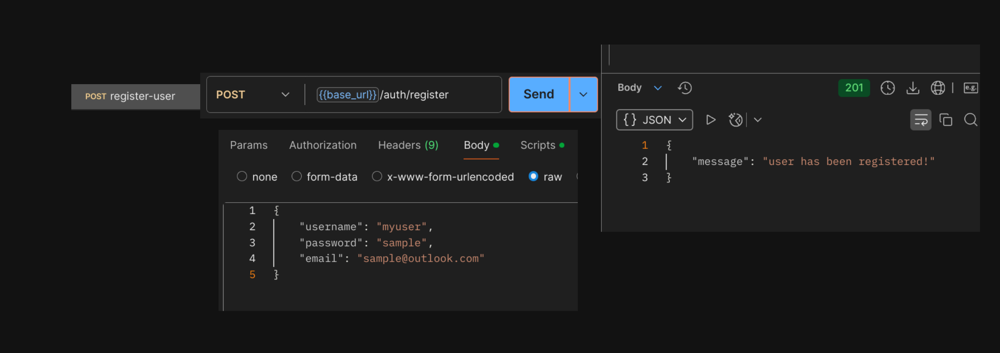
- `GET /user` - see the new registered user!
  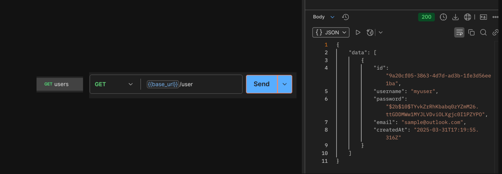
- `POST /auth/register` - ensure you can't register the same user!
  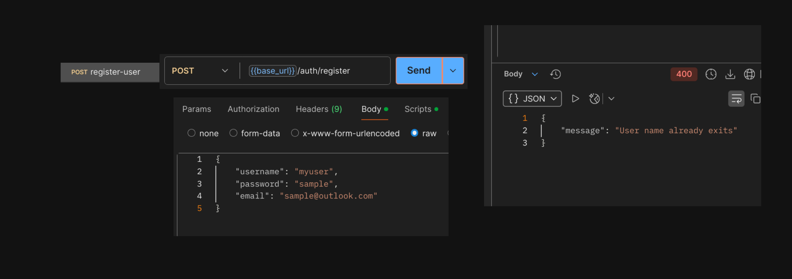
- `POST /auth/register` - ensure you can register a `new user`
  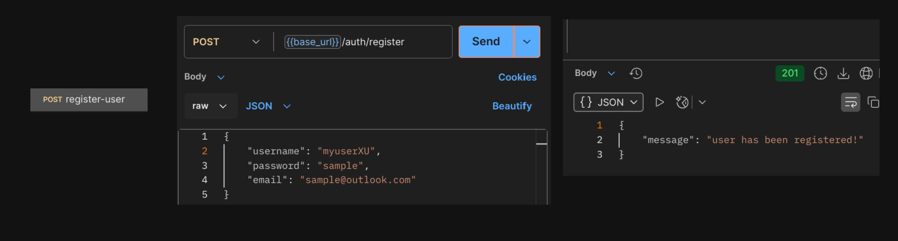
- `GET /user` - check your `new users`. Notice that the passwords are the same for the users but different hashes!
  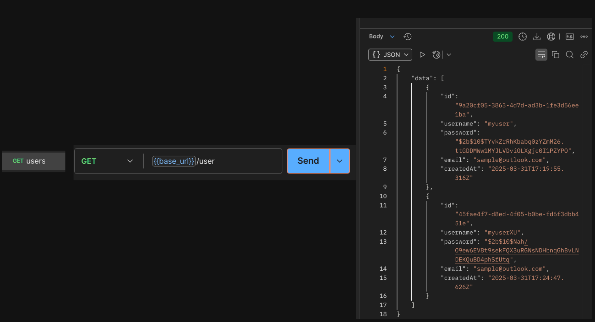
- `GET /recipes` - Let's check recipes with no token
  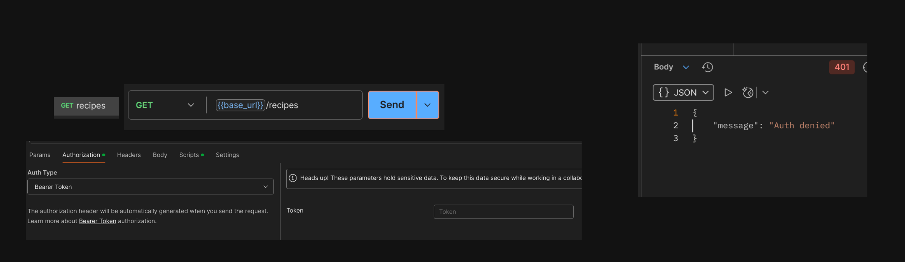
- `GET /recipes` - Let's check recipes with invalid token
  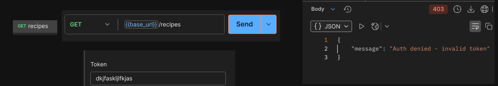
- `GET /auth/login` - Now, let's login. `Copy` the token to use `/recipes`
  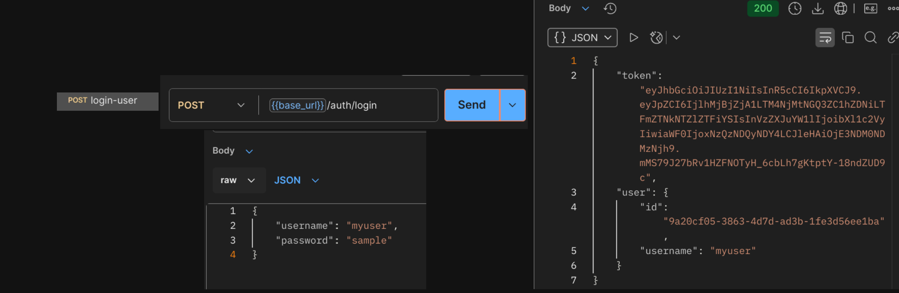
- `GET /recipes` - Now, let's use the `token` we got from login and pass it in the `authorization` header.
  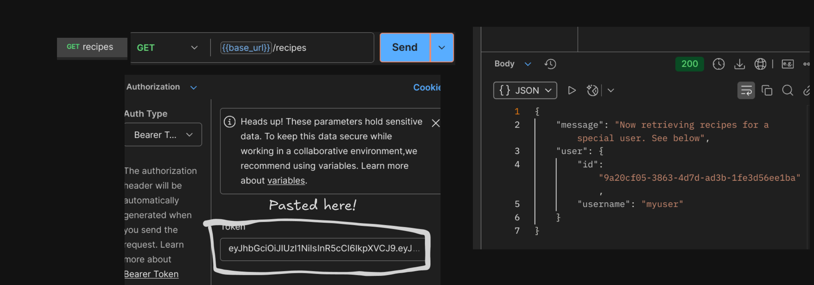

> [!IMPORTANT]
> Congratulations! You have a basic auth backend.
> In case you get stuck, I will post the `class whiteboard` at the end of the class. This way you can come prepared for next class project.

### Let's prep the frontend

Go into `/frontend` folder. You have a basic `vite` template using React.

1. Build a `Header` component
2. Build a `Login` component
3. Build a `Register` component

Your frontend must be responsive and look like

> [!IMPORTANT]
> Use [react-router](https://reactrouter.com/) to create a SPA.
> `http://localhost:5173/register`, `http://localhost:5173/login`

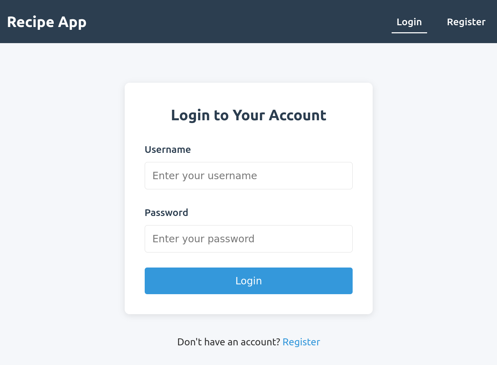
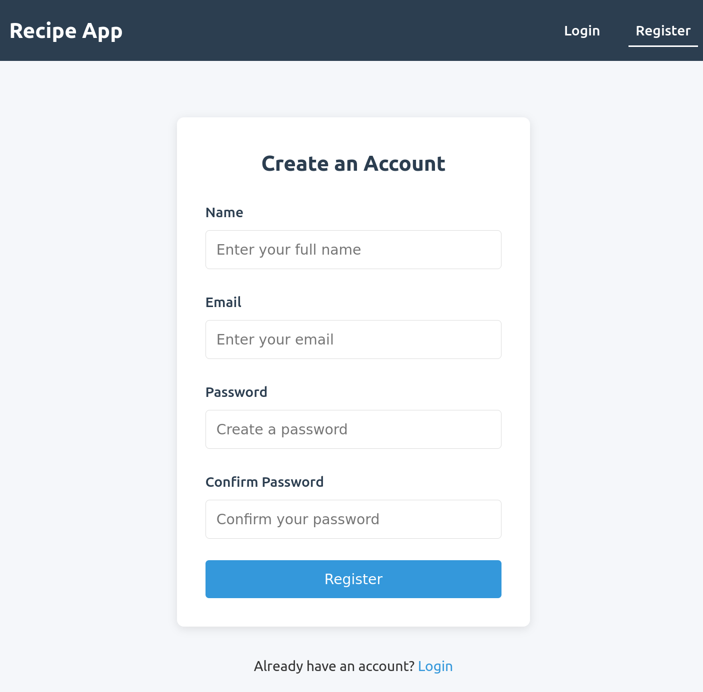
